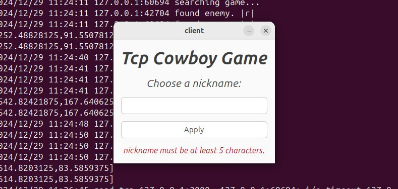

# tcp-cowboy-game
 

## Описание проекта
*tcp-cowboy-game* — это сетевая игра, в которой игроки соревнуются в скорости реакции. Ваша цель — быстрее соперника достать пистолет и выстрелить, нажав соответствующие кнопки. Кто выполнит эти действия первым, тот побеждает.

Игра реализована на языке Go с использованием протокола TCP. Клиентская часть использует библиотеку **gotk3 v0.6.1** для создания графического интерфейса. Серверная часть разработана с использованием каналов Go для управления потоками и синхронизации взаимодействия игроков.

[Пример работы](https://drive.google.com/file/d/1L1aiB5HjsUES98_iKFicU5VYFaWg6HUD/view?usp=sharing)

## Основные особенности
- **Сетевая игра в реальном времени:** поддержка одновременного подключения двух игроков через TCP.
- **Графический интерфейс:** клиентская часть с визуальным отображением действий.
- **Серверная часть:** реализована с использованием каналов для обработки событий и управления игровыми сессиями.

## Технологии
- **Язык программирования:** Go 1.19
- **Библиотека GUI:** gotk3 v0.6.1

## Установка и запуск

Собранные файлы для linux уже лежат в ```linux-builded-bins```. Но если нужно собрать заново, то читать дальше. 

### Требования
1. Установленный Go версии 1.19.
2. Установленная библиотека gotk3 v0.6.1. Инструкции по установке можно найти в [репозитории gotk3](https://github.com/gotk3/gotk3).
3. Установленный GTK 3. Скачать можно на [официальном сайте](https://www.gtk.org/docs/installations/).

### Установка
1. Склонируйте репозиторий:
   ```bash
   git clone git@github.com:emelvv/tcp-cowboy-game.git
   ```
2. Перейдите в директорию проекта:
   ```bash
   cd tcp-cowboy-game
   ```
3. Соберите сервер и клиент:
   ```bash
   go build client.go
   cd server
   go build server.go
   ```

### Запуск
#### Сервер
1. Запустите сервер:
   ```bash
   ./server <Здесь введите порт (например 3000)>
   ```
2. Сервер начнет прослушивать входящие подключения на заданном порту.

#### Клиент
1. Запустите клиент:
   ```bash
   ./client <Здесь введите адрес (например 127.0.0.1:3000)>
   ```
2. У вас откроется окно, в котором нужно будет ввести никнейм, после этого можно начать игру.

## Правила игры
1. После подключения двух игроков появляется окно с игрой.
2. Игроки должны:
   - Нажать кнопку для "доставания пистолета".
   - Затем как можно быстрее нажать на кружок, который будет на экране для "выстрела".
3. Побеждает игрок, который выполнит эти действия первым.
4. Результат отображается на экране обоих игроков.

## Структура проекта
```
├── LICENSE.txt
├── README.md             # Описание проекта
├── assets                
│   └── image.png         
├── client.go             # Исходный код клиентской части
├── go.mod                
├── go.sum                
├── linux-builded-bins    # Собранные файлы для Linux
│   ├── client            # Исполняемый файл клиента
│   ├── server            # Исполняемый файл сервера
│   └── ui.glade          # пользовательский интерфейс
└── server                # Каталог серверной части
    └── server.go         # Исходный код серверной части
```

## Дополнительная информация
- **Обработка ошибок:** Сервер автоматически завершает сессию в случае обрыва соединения.
- **Расширение возможностей:** Вы можете легко добавлять новые элементы геймплея, модифицируя клиент или сервер.

## Лицензия
[MIT License](LICENSE.txt) — свободное использование, изменение и распространение проекта.